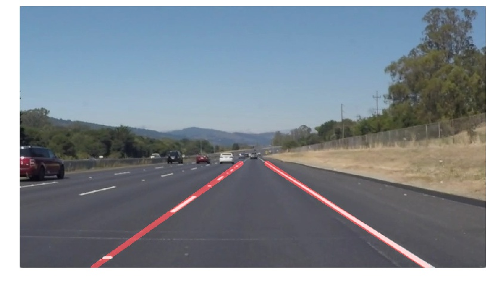
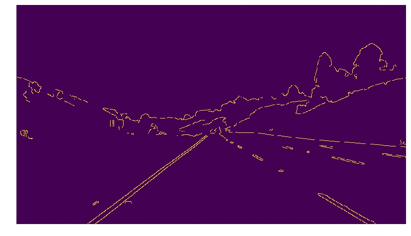
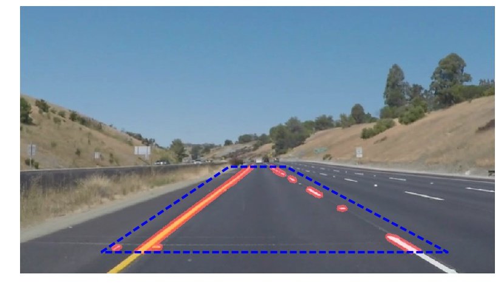
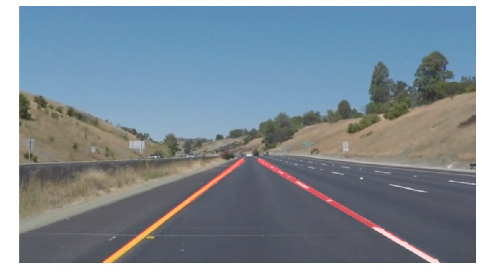

# **Finding Lane Lines on the Road**

Project Overview
---

When we drive, we use our eyes to decide where to go.  The lines on the road that show us where the lanes are act as our constant reference for where to steer the vehicle.  Naturally, one of the first things we would like to do in developing a self-driving car is to automatically detect lane lines using an algorithm.

In this project you will detect lane lines in images using Python and OpenCV.  OpenCV means "Open-Source Computer Vision", which is a package that has many useful tools for analyzing images.

To complete the project, two files will be submitted: a file containing project code and a file containing a brief write up explaining your solution. We have included template files to be used both for the [code](https://github.com/udacity/CarND-LaneLines-P1/blob/master/P1.ipynb) and the [writeup](https://github.com/udacity/CarND-LaneLines-P1/blob/master/writeup_template.md).The code file is called P1.ipynb and the writeup template is writeup_template.md

To meet specifications in the project, take a look at the requirements in the [project rubric](https://review.udacity.com/#!/rubrics/322/view)

[//]: # (Image References)

[image1]: ./examples/grayscale.jpg "Grayscale"

### 1. Lane-finding pipeline. As part of the description, explain how you modified the draw_lines() function.

My pipeline consists of the following steps: (1) blur the image using Gaussian Blur function, (2) find the Canny edges, (3) choose the region of interest (masked region), (4) find the Hough lines, (5) extrapolate the Hough lines to get two lane lines (left and right).

<!--
[original image](./test_images/whiteCarLaneSwitch.jpg)
-->

I did not convert the image into grayscale colorspace because I found it did not work well with the Challenge video. I think the reason grayscale was suggested in the lesson is speed. However, in this project I focus on finding the most possible accurate lane lines so I keep the normal RGB colorspace.

Probably the most tricky part of the project is to get reasonable Hough lines. At first, I thought the ideal Hough lines should have the correct slope and be as long as possible. Then it would be easier to extend the already long and mostly correct Hough lines to get the lane lines. As a result, at first I chose the parameters to get only a few Hough lines.

Unfortunately, when I tried the pipeline on a video, many frames do not output any Hough lines because the criteria were too selective. Now the idea is changed. The parameters are tuned so each frame in the video output numerous Hough lines, then I filter out the lines with bad slopes (too vertical or too horizontal). This way, I always have plenty of Hough lines in each frame.

To draw a single lane line in each side, I extrapolate the Hough lines using function numpy.polyfit(). I learn this idea from https://peteris.rocks/blog/extrapolate-lines-with-numpy-polyfit/. Because a line is a polynomial function of order 1, the numpy.polyfit function connects all end points (that belong to the Hough lines) using a line. That line is the lane line I need to find.

### 2. Identify potential shortcomings with your current pipeline

The challenge video shows many potential shortcomings of the current pipeline. There are situations that can be tricky. For example, the pavement of the road changes color abruptly and the camera does not calibrate the brightness on time. This might make it difficult to see the lane lines in the image.

Other problems include shadows of objects on the road (such as trees or buildings) and curvy road. Definitely we need more advanced methods to solve these problems.

### 3. Suggest possible improvements to your pipeline

Currently the lane lines found using my pipeline flickers a bit in the videos. A common idea is instead of find the lane lines in each frame, we compute the average of line slopes over a period of time.

While this idea would make the lane lines much more stable, I'm not sure that the average slope is a good solution. In case we need to take a sharp turn, surely we would get lane lines with very inaccurate slopes. And do not forget that it is more crucial to find the correct lane lines when making turns rather than driving straight like in the videos. Therefore, I want to find a solution that can find reasonably accurate lane lines in real-time (not an average lane line).
